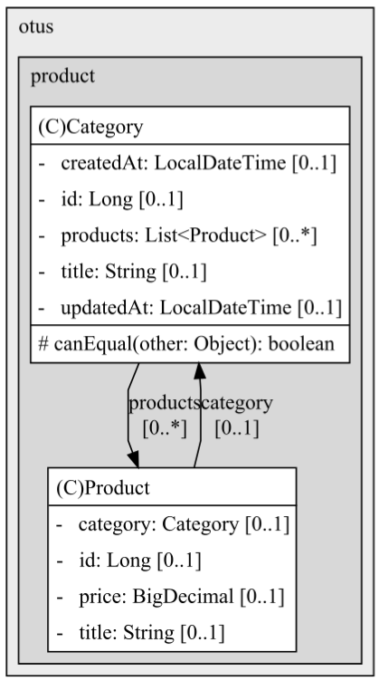

## ПРОЕКТНАЯ РАБОТА
### Собрать проект
`mvn package`
### Собрать и запушить docker образы приложений
```
docker image build --platform linux/amd64 -t alexadubinina87/auth-gateway:12 ./ms/auth-gateway/auth-gateway
docker push alexadubinina87/auth-gateway:12

docker image build --platform linux/amd64 -t alexadubinina87/auth-service:11 ./ms/auth-service/auth-service
docker push alexadubinina87/auth-service:11

docker image build --platform linux/amd64 -t alexadubinina87/inventory-service:11 ./ms/inventory-service/inventory-service
docker push alexadubinina87/inventory-service:11

docker image build --platform linux/amd64 -t alexadubinina87/product-service:11 ./ms/product-service/product-service
docker push alexadubinina87/product-service:11

docker image build --platform linux/amd64 -t alexadubinina87/notification-service:11 ./ms/notification-service/notification-service
docker push alexadubinina87/notification-service:11

docker image build --platform linux/amd64 -t alexadubinina87/order-service:11 ./ms/order-service/order-service
docker push alexadubinina87/order-service:11

docker image build --platform linux/amd64 -t alexadubinina87/payment-service:11 ./ms/payment-service/payment-service
docker push alexadubinina87/payment-service:11
```
### Установить ingress
```
helm install nginx ingress-nginx/ingress-nginx --namespace otus -f nginx-ingress.yaml
kubectl apply -f ./charts/ingress/ingress.yaml
helm upgrade --install nginx ingress-nginx/ingress-nginx --namespace otus -f ./charts/ingress/values.yaml
```
### Установить постгрес
```
helm install otus-postgres ./shop-charts/components/postgres --namespace otus -f ./shop-charts/components/postgres/values.yaml
```
### Установить Kafka
```
helm upgrade my-kafka oci://registry-1.docker.io/bitnamicharts/kafka -n otus --set service.port=9092 --set auth.enabled=false --set auth.clientProtocol=plaintext --set kafka.autoCreateTopicsEnable=true --set listeners.client.protocol=plaintext
```
### Установить Redis
```
kubectl apply -f ./shop-charts/components/redis -n otus
```
### Установить приложения
```
helm install auth-gateway ./shop-charts/apps/auth-gateway --namespace otus --atomic -f ./shop-charts/apps/auth-gateway/values.yaml
helm install auth-service ./shop-charts/apps/auth-service --namespace otus --atomic -f ./shop-charts/apps/auth-service/values.yaml
helm install inventory-service ./shop-charts/apps/inventory-service --namespace otus --atomic -f ./shop-charts/apps/inventory-service/values.yaml
helm install product-service ./shop-charts/apps/product-service --namespace otus --atomic -f ./shop-charts/apps/product-service/values.yaml
helm install notification-service ./shop-charts/apps/notification-service --namespace otus --atomic -f ./shop-charts/apps/notification-service/values.yaml
helm install order-service ./shop-charts/apps/order-service --namespace otus --atomic -f ./shop-charts/apps/order-service/values.yaml
helm upgrade payment-service ./shop-charts/apps/payment-service --namespace otus --atomic -f ./shop-charts/apps/payment-service/values.yaml
```
### Установить Prometheus, Grafana
```
helm install prometheus prometheus-community/prometheus --namespace monitoring --create-namespace
helm install grafana grafana/grafana -n monitoring
```

### Cбор метрик с nginx
`helm upgrade prometheus prometheus-community/prometheus --namespace monitoring -f ./charts/monitoring/prometheus-values.yaml`

### Cбор метрик с Kafka
```
helm repo add prometheus-community https://prometheus-community.github.io/helm-charts

helm upgrade --install kafka-exporter prometheus-community/prometheus-kafka-exporter --set service.labels."app\.kubernetes\.io/name"=kafka-exporter --namespace otus -f ./charts/monitoring/kafka-exporter-values.yaml
```


# Описание проекта 

### Реализованы следующие пользовательские сценарии

Есть клиент  
И есть интернет-магазин  
И клиент переходит на страницу Товары
Тогда появляется список товаров

Когда клиент нажимает карточку на товар в списке результатов поиска  
Тогда клиент переходит на карточку с описанием товара

Когда клиент нажимает на кнопку "Добавить в корзину"  
Тогда товар добавляется в корзину

Когда клиент переходит в корзину  
Тогда он видит список всех добавленных им в корзину товаров

Когда клиент нажимает на кнопку "Удалить из корзины"  
Тогда товар удаляется из корзины

Когда клиент нажимает на кнопку "Пополнить баланс"   
Тогда возникает форма ввода суммы пополнения баланса

Когда клиент нажимает на кнопку "Пополнить"   
Тогда баланс клиента пополняется на указанную им сумму

Когда клиент нажимает на кнопку "Оформить заказ"   
Тогда происходит списание денег с баланса и заказ передается в обработку

Когда оплата заказа прошла успешно   
Тогда статус заказа переходит в состояние "Оплачен"
И клиенту приходит уведомление с информацией о заказе и успешной оплате  
И заказ резервируется на складе  
И создаётся заявка для службы доставки


### Системные действия:
- клиент может просматривать список товаров
- клиент может получить информацию о товаре
- клиент может положить товар в корзину
- клиент может удалить товар из корзины
- клиент может оформить заказ
- клиент может пополнить баланс
- клиент может просмотреть баланс
- клиент может оплатить заказ
- приложение отправляет клиенту уведомление с информацией о сделанном заказе
- приложение отправляет клиенту уведомление об успешной/неуспешной оплате
- приложение резервирует товар на складе после оформления заказа
- приложение передаёт заказ в службу доставки


### Модель на основе ООП

Основные сущности:
- Клиент (User)
- Товар (Product)
- Корзина (Card)
- Заказ (Order)
- Аккаунт (Account)
- Склад (Inventory)
- Оплата (Payment)





Сервисы:
- AuthService
- ProductService (поиск товара и просмотр информации о нём)
- OrderService (добавление/удаление товаров в корзине и оформление заказа)
- NotificationService (отправка уведомлений)
- InventoryService (передача информации о заказе на склад)
- PaymentService (оплата заказа)
- DeliveryService (передача заказа в службу доставки) //todo


### Функциональная модель


### Схема взаимодействия сервисов


### Реализация

Приложение состоит из 6 микросервисов и сервиса Api-Gateway.

Реализована jwt-token authorization.

Схема:


Архитектура спроектирована с использованием паттерна Сага, основанной на оркестровке (роль оркестровщика выполняет order-service).  

_Для справки:  
Сага представляет собой набор локальных транзакций. Каждая локальная транзакция обновляет базу данных и публикует сообщение или событие, инициируя следующую локальную транзакцию в саге.  
Если транзакция завершилась неудачей, например, из-за нарушения бизнес правил, тогда сага запускает компенсирующие транзакции, которые откатывают изменения, сделанные предшествующими локальными транзакциями.  
Оркестровка (Orchestration) — оркестратор говорит участникам, какие транзакции должны быть запущены._


Идемпотентность реализована с помощью ключа идемпотентности x-request-id в рамках сервиса order-service.
Генерация ключа происходит в order-service.


